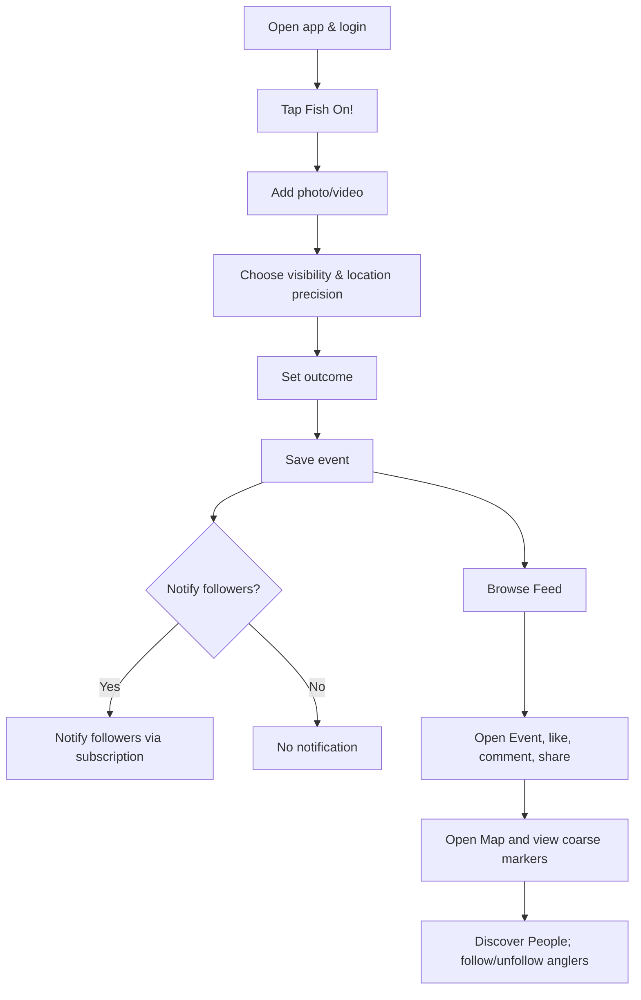
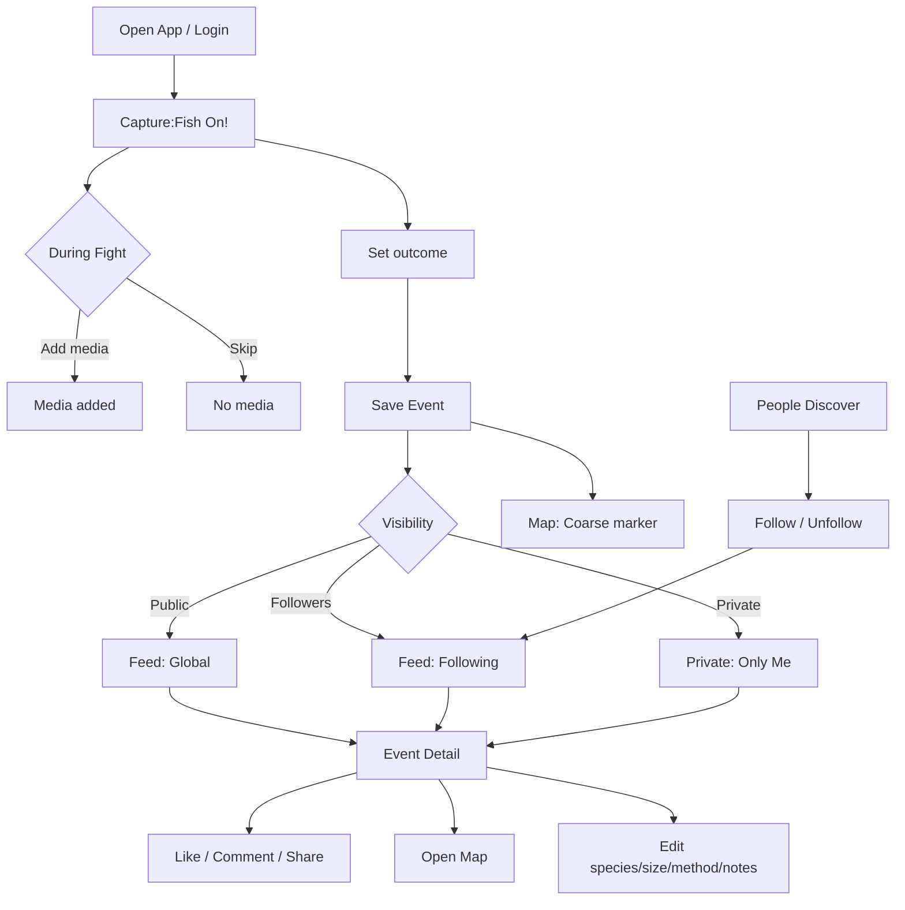
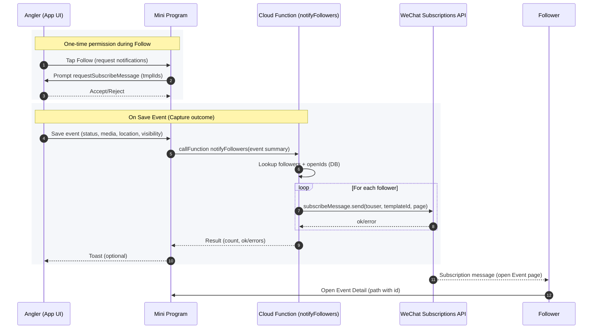

# Fish On!

Wechat Mini Program to share real-time “Fish On!” status — capture the moment, rally friends, and build a respectful angling community.

## User Journey



## Flowchart



---

## Subscription Flow



## 1) Vision & Goals

- Build the fastest, most delightful way for anglers to share a live “Fish On!” moment with minimal friction.
- Encourage community excitement while protecting sensitive fishing spots and respecting local norms.
- Become the default lightweight log for fights, catches, and sessions on WeChat.

## 2) Target Users & Use Cases

- Recreational anglers: share the excitement and get kudos in real time.
- Fishing guides/clubs: showcase action to followers/private groups.
- Tournaments: verify live fights and capture outcomes quickly.

Typical flows:
- Live “Fish On!” broadcast: one tap to start, optional details, followers notified.
- Post-catch recap: add outcome (landed/lost/released), photos or short video.
- Trip logbook: timeline of fights/catches with stats, gear, and conditions.
- Friend alerts: notify close contacts when you’re on fish nearby.

## 3) MVP Scope

Core experience (ship in 6–8 weeks):
- Auth: WeChat login, basic profile (nickname, avatar).
- Create Event: big “Fish On!” button starts an event with auto timestamp.
	- Optional fields: species, size, method/lure, water body, notes.
	- Status state machine: Hooked → Landed | Lost | Released.
	- Media: up to 3 photos and a short video (10–30s cap).
	- Location: device-based with privacy levels (Exact / ~1km / ~10km / Hidden).
	- Visibility: Public / Followers / Private.
- Feed: tabs for Nearby, Following, Global; infinite scroll.
- Map: clustered pins for recent events; basic heat aggregation.
- Reactions: like and basic comments.
- Notifications: subscription-based push to followers when a user hits “Fish On!”.
- Offline friendly: queue post if no signal, auto-upload later.

Non-goals for MVP:
- Tournaments/leaderboards, gear integrations, AR trophies, marketplace.

## 4) Later (Post-MVP)

- Tournament mode with live leaderboards and anti-cheat checks.
- Advanced analytics (species trends, strike rates, CPUE-style stats).
- Weather/solunar overlays; tidal/current data.
- Clubs/crews with private maps and admin tools.
- Web export/share pack (privacy-preserving links with obfuscated locations).

## 5) Privacy & Safety (Principles by Design)

- Default location privacy: start at ~1–10km granularity; exact requires explicit opt-in per event.
- Sensitive spot protection: obfuscation + no precise reverse-geocoding; allow “Hidden location”.
- Moderation: report, block, basic toxicity filters; rate limits on spam.
- Data control: edit/delete events; user can purge media and comments they own.
- Age & content: safe-media defaults; comply with Mini Program content policies.

## 6) Success Metrics

- Activation: % of new users who post a “Fish On!” in first 7 days.
- Engagement: Fish-On events/day (per DAU), avg fight duration, reactions/event.
- Retention: D7/D30 retention; % of users with 3+ events in 30 days.
- Network: follower-to-following ratio; notification open rates; share rate.
- Quality: crash-free sessions > 99.5%, media upload success > 98%.

## 7) Competitive Landscape

- Global: Fishbrain, WeFish; Local: WeChat groups/朋友圈.
- Differentiation: ultra-fast live “Fish On!” workflow, strong privacy controls, lightweight and WeChat-native experience.

## 8) Technical Architecture (Draft)

- Frontend: WeChat Mini Program (WXML/WXSS/JS or TS).
	- Key pages: Login, Capture (Fish On!), Event Detail, Feed, Map, Profile, Settings.
- Backend: Tencent CloudBase (TCB) or self-managed Tencent Cloud stack.
	- DB: CloudBase DB or MySQL/PostgreSQL (start with CloudBase for speed).
	- Storage: COS for images/videos.
	- Functions: cloud functions for media processing, location obfuscation, notifications.
	- Real-time: CloudBase realtime DB or WebSocket channel for event updates.
- Maps: Tencent Map SDK; server-side tile aggregation for heatmap.
- Notifications: WeChat subscription messages for followers.
- Analytics: WeChat analytics + custom events (activation, retention, funnel).
- CI/CD: WeChat DevTools + GitHub Actions; envs: dev/test/prod; feature flags.

## 9) Data Model (MVP)

User
- `id`, `wxOpenId`, `nickname`, `avatar`, `bio`, `followersCount`, `followingCount`, `settings`.

Event
- `id`, `userId`, `status` (Hooked|Landed|Lost|Released), `startedAt`, `endedAt`, `durationSec`.
- `species`, `size`, `method`, `lure`, `waterBody`, `notes`.
- `media[]` (type, url, thumbUrl, lengthSec).
- `location` { lat, lng, geohash, precisionLevel, obfuscationLevel }.
- `visibility` (Public|Followers|Private), `likeCount`, `commentCount`.

Comment
- `id`, `eventId`, `userId`, `text`, `createdAt`.

Follow
- `followerId`, `followeeId`, `createdAt`.

## 10) Key Flows (UX)

- One-tap start: Big “Fish On!” button on home; starts timer and event.
- During fight: add quick tags (species guess, method), optional media.
- Wrap-up: tap outcome; add photo/video; choose visibility and location precision.
- Feed & map: browse recent activity; react/comment; follow users.
- Notifications: followers get a ping when user starts an event.

## 11) Localization & Accessibility

- Languages: `zh-CN` first; `en-US` later.
- Accessibility: high-contrast theme, large-tap targets, offline tolerance.

## 12) Monetization (Later)

- Premium analytics/insights; club subscriptions; brand/event partnerships.
- No ads in MVP; keep UX clean and fast.

## 13) Project Plan & Timeline (Indicative)

- Week 1–2: UX wireframes, data model, architecture spike, map POC.
- Week 3–4: Implement Auth, Capture flow, Event model, Feed (Following/Global).
- Week 5: Map clustering, notifications, privacy controls, offline queue.
- Week 6: Polish, QA, beta with 20 anglers; performance tuning; review submission.

## 14) Risks & Mitigations

- Location privacy concerns → privacy-by-default, coarser granularity, easy “Hidden”.
- Spot burning/community norms → educate in onboarding; default obfuscation; private mode.
- Media upload reliability → background retries, COS multi-part, size caps.
- Battery/network during fights → lean UI, optional media, offline-first events.
- WeChat review constraints → content filters, lawful categories, required docs.

## 15) Compliance & Review (WeChat)

- Mini Program categories must match features (likely “社交/工具”).
- Entity & filing may be required; personal accounts have feature limits.
- Content guidelines: no illegal wildlife trade; moderate location sensitivity.

## 16) Dependencies

- WeChat DevTools, Tencent CloudBase SDK, Tencent Map SDK, COS SDK.

## 17) Open Questions

- Tournament use cases: separate app mode or within same app?
- Default location precision: 1km or 10km?
- Video cap: 10s vs 30s for best balance of upload speed.
- Should “Nearby” scope be dynamic by region density?

## 18) Next Steps

- Define wireframes for Capture, Event Detail, Feed, Map, Profile.
- Choose stack: CloudBase-first or custom backend.
- Set up repo structure and WeChat Mini Program scaffolding.
- Draft data and security rules; implement location obfuscation service.

---

Questions, feedback, or fishing stories welcome — let’s ship it! 🎣

## Dev Quick Start

- Install WeChat DevTools (latest) on macOS.
- In DevTools, Import project and choose this folder `wx_fish_on`.
- Set your Mini Program AppID (replace `touristappid` in `project.config.json`).
- Run: use the tab bar to try `Capture`, save an event, then check `Feed` and `Map`.
- Local storage only in MVP; no backend required to test basic flow.

Cloud (optional)
- Enable Cloud in WeChat DevTools and create an env; set env id in DevTools or store via `wx.setStorageSync('cloudEnv', '<your-env-id>')` in console.
- Deploy `cloudfunctions/notifyFollowers` in DevTools if you want subscription messages.
- Replace `TEMPLATE_ID_PLACEHOLDER` in `miniprogram/utils/notify.js` and cloud function `index.js` with your template id.

## Project Structure

- `miniprogram/app.json|app.js|app.wxss`: app config, bootstrap, global styles.
- `miniprogram/pages/capture/*`: one-tap Fish On, timer, media, outcomes.
- `miniprogram/pages/feed/*`: local feed of saved events.
- `miniprogram/pages/event/*`: event detail, like/share/comments, edits.
- `miniprogram/pages/map/*`: map with coarse markers for events with location.
- `miniprogram/pages/profile/*`: profile + `Get WeChat Profile` login.
- `miniprogram/pages/people/*`: discover people from recent events and follow/unfollow.
- `miniprogram/pages/login/*`: simple login page.
- `miniprogram/utils/follow.js`: local follow graph (ids) helpers.
- `miniprogram/utils/notify.js`: request subscription + cloud call wrapper.
- `project.config.json`: WeChat project config (replace `touristappid`).
- `sitemap.json`: minimal sitemap.
- `cloudfunctions/notifyFollowers/*`: stub cloud function to send subscription messages (requires real follower openIds + template).

## Mock Testing (Local)
- Open WeChat DevTools simulator, import `wx_fish_on` and set AppID.
- In Profile tab:
	- Tap `Seed Demo Data` to create 3 sample events (Landed/Lost/Released).
	- Open Feed → switch tabs (Global/Nearby/Following) to verify filters.
	- Open Map to see coarse markers for seeded events.
	- Tap a Feed item to open Event → like, comment, edit fields, share, open map.
	- Use `Clear Demo Data` to reset local storage.

	One-click smoke test (UI)
	- Profile → tap `Run Smoke Test` to clear, seed, open Feed, open first Event (like + comment), and jump to Map automatically.

Simulator smoke test (Console)
- Open DevTools Console and paste the contents of `miniprogram/scripts/smoke.js`.
- Then run:

```
getApp().SMOKE.run()
```

- Or step through manually:

```
getApp().SMOKE.clear()
getApp().SMOKE.seed(5)
getApp().SMOKE.goFeed()
// wait for Feed to load
getApp().SMOKE.openFirstEvent()
getApp().SMOKE.likeCurrentEvent()
getApp().SMOKE.addComment('Tight lines!')
getApp().SMOKE.goMap()
```

## Current MVP vs Plan

- Implemented now:
	- Capture → media (<=30s), outcomes (Landed/Lost/Released), visibility picker, location precision (Hidden/Coarse/Exact).
	- Feed → local-only with tabs: Global, Nearby (~10km radius), Following (local-only: your events).
	- Map → default markers (no clustering/heat yet).
	- Event Detail → media playback, like/unlike, share, comments, edit species/size/method/notes, delete event.
	- Profile/Login → optional WeChat profile; People → discover/follow users.
- Not yet (planned):
	- Subscriptions/notifications (end-to-end, with real follower openIds and deployed cloud function); real follow graph and cross-user Following.
	- Cloud backend (CloudBase/DB/COS), media upload, real-time updates.
	- Map clustering and heatmaps; tournament mode; analytics.

Local-mode limitations
- Events, likes, comments, and follows live only on-device (no sync).
- `user.id` is set to `me` for local testing; change when integrating auth/backend.

Next suggested step
- Wire up CloudBase (users, follows, events, media) and migrate reads/writes from local storage; then enable real Following and subscriptions.
